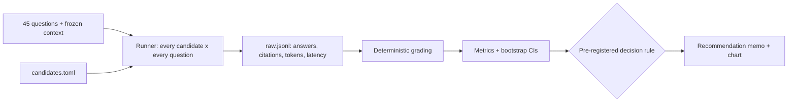

# LLM Model Selection

[](https://github.com/tsriharsha402/llm-model-selection/actions/workflows/ci.yml)


A small, rigorous framework for one of the most common decisions in AI engineering:
**which model should this feature run on?** It measures quality, latency and cost on
*your* task, puts confidence intervals on the differences, and applies a decision rule
that was written down before any results existed. The output is a one-page
recommendation memo.

The first decision it makes is for
[production-rag-service](https://github.com/tsriharsha402/production-rag-service):
keep `claude-opus-5-5`, or move to a cheaper configuration?

## Executive summary

| | |
|---|---|
| **Decision** | Which Claude configuration production-rag-service should use |
| **Candidates** | Opus 5.5 (medium and low effort), Sonnet 5.5 (medium and low), Haiku 4.5 |
| **Evidence** | 45 real questions with frozen retrieval context, graded deterministically: required facts, correct citation, correct "I don't know" |
| **Decision rule** | Cheapest candidate that passes the quality gates and is statistically non-inferior (within 5 points) to the best one. [Pre-registered](docs/evaluation-plan.md) |
| **Budget** | Estimated $0.70-$4.65 for a full run (`make estimate`) |
| **Status** | Framework complete and tested. **First run pending**; the [memo](memo/RECOMMENDATION.md) is generated from its results |

## Why this approach

Model choices are usually made on vibes: a few prompts in a playground, then "it seemed
fine." That fails in both directions: teams overpay for a large model they don't need,
or downgrade and silently lose quality. Three things make this benchmark decision-grade:

1. **Same inputs for every candidate.** Retrieval is frozen, so differences come from
   the model alone.
2. **Uncertainty is reported, not hidden.** Pass rates come with 95% bootstrap intervals,
   and "as good as" requires a paired non-inferiority test, not a raw difference.
3. **The rule comes before the data.** Gates, margin and tie-breakers are committed in
   [`candidates.toml`](candidates.toml) and the
   [evaluation plan](docs/evaluation-plan.md) before any run. Nobody can move the goalposts
   after seeing which model they prefer.

## How it works



| Step | What happens |
|---|---|
| **Estimate** | `make estimate` projects the cost of a full run from prompt sizes and current prices. No API calls |
| **Run** | Calls every candidate on every question with the exact request production sends (search-result blocks with citations). Shows the estimate and asks for confirmation first. Resumable: re-running skips completed calls and retries failed ones |
| **Grade** | An answer passes if it contains every required fact and cites the right document; an "abstain" question passes if the model says it doesn't know |
| **Decide** | Eligibility gates → quality leader → paired non-inferiority test → cheapest survivor |
| **Report** | Results table, quality-vs-cost chart and a memo with the recommendation, the tradeoffs versus today's configuration, risks and a rollout plan |

### What gets measured

| Metric | Why it matters |
|---|---|
| Pass rate (95% CI) | Overall correctness on the task |
| Keyword recall | Does the answer contain the facts the user needs? |
| Citation accuracy | Can users verify the answer? Gate: ≥ 90% |
| Abstention accuracy | Does it say "I don't know" instead of inventing an answer? Gate: ≥ 80% |
| Failure rate | Refusals and API errors after retries. Gate: ≤ 2% |
| Latency p50 / p95 | User experience. Gate: p95 ≤ 10s |
| Cost per 1,000 questions | From real token usage and [current prices](src/model_selection/pricing.py) |

## Quickstart

```bash
git clone https://github.com/tsriharsha402/llm-model-selection
cd llm-model-selection
python -m venv .venv && source .venv/bin/activate
make install
make test         # no API key needed
make estimate     # what a full run will cost

export ANTHROPIC_API_KEY=...
make benchmark    # shows the estimate, asks to confirm, runs, writes the memo
```

Useful options:

```bash
python -m model_selection run --limit 5 --candidates haiku-4.5   # cheap smoke test
python -m model_selection report --run-id 2026-10-01             # rebuild report from saved results
```

## Reusing it for another decision

1. Replace `data/grounded_qa.jsonl` with cases from your task (same fields).
2. Adjust `prompt.py` to send exactly what your production code sends.
3. Edit the candidates, gates and margin in `candidates.toml`, and commit the plan
   **before** the first run.

## Project structure

```
candidates.toml          candidates and the pre-registered decision rule
data/grounded_qa.jsonl   45 cases with frozen retrieval context
docs/evaluation-plan.md  the plan, written before results
memo/RECOMMENDATION.md   generated recommendation memo
results/                 one folder per run: raw results, summary, chart
scripts/build_dataset.py rebuilds the dataset from production-rag-service
src/model_selection/
  prompt.py              the request under test (mirrors production)
  runner.py              concurrent, resumable benchmark runner
  grading.py             deterministic grading
  stats.py               bootstrap confidence intervals
  decision.py            metrics per candidate and the decision rule
  estimate.py            pre-run cost estimate
  report.py              table, chart and memo
tests/                   unit tests with a fake API client
```

## Limitations

- **45 questions** give intervals of roughly ±10 points. Small real differences won't be
  detectable; the rule then keeps the leader rather than guessing.
- **One task.** Grounded Q&A over short policy documents. Other workloads need their own
  test set.
- **Keyword grading** can fail a correct paraphrase and can't judge tone or completeness.
  An LLM-graded rubric is the natural next addition.

## License

[MIT](LICENSE)
