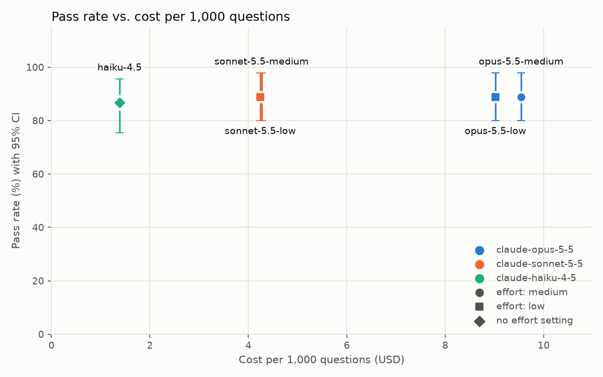

# Model recommendation: production-rag-service

**Date:** 2026-10-05  
**Evidence:** benchmark run `2026-10-05`, 45 questions per candidate  
**Decision rule:** pre-registered in [`candidates.toml`](../candidates.toml), see [evaluation plan](../docs/evaluation-plan.md)

## Recommendation

No candidate passed the eligibility gates, so none can be recommended.

## Options compared

| Candidate | Pass rate (95% CI) | Keyword recall | Citation acc. | Abstention acc. | Failures | Latency p50 / p95 | Cost / 1K questions | Verdict |
|---|---|---|---|---|---|---|---|---|
| opus-5.5-medium | 88.9% (80%-98%) | 88.5% | 87.2% | 100.0% | 0.0% | 2.9s / 6.1s | $9.54 | Ineligible: citation accuracy 87% < 90% |
| opus-5.5-low | 88.9% (80%-98%) | 88.5% | 87.2% | 100.0% | 0.0% | 2.6s / 3.7s | $9.02 | Ineligible: citation accuracy 87% < 90% |
| sonnet-5.5-medium | 88.9% (80%-98%) | 87.2% | 87.2% | 100.0% | 0.0% | 1.9s / 4.9s | $4.27 | Ineligible: citation accuracy 87% < 90% |
| sonnet-5.5-low | 88.9% (80%-98%) | 87.2% | 87.2% | 100.0% | 0.0% | 1.7s / 4.2s | $4.25 | Ineligible: citation accuracy 87% < 90% |
| haiku-4.5 | 86.7% (76%-96%) | 84.6% | 87.2% | 100.0% | 0.0% | 0.8s / 1.1s | $1.38 | Ineligible: citation accuracy 87% < 90% |

## Risks and mitigations

- **Small sample.** 45 questions give wide intervals; differences of a few points are not distinguishable. Mitigation: grow the evaluation set with real, anonymized user questions and re-run before any further downgrade.
- **One task, one corpus.** Results apply to grounded Q&A over short policy documents. Longer documents or multi-step questions need their own run.
- **Keyword grading is strict and narrow.** It can fail a correct paraphrase and cannot judge tone or completeness. Mitigation: add an LLM-graded rubric and spot-check a sample of answers by hand.
- **Model updates.** Re-run this benchmark on every model, prompt or retrieval change; the CI quality gate in production-rag-service catches retrieval regressions only.

## Next steps

1. Change `LLM_MODEL` / `LLM_EFFORT` in production-rag-service behind a feature flag.
2. Roll out to 10% of traffic for one week and compare abstention rate, user feedback and cost per answer against the control group.
3. Roll back automatically if the abstention rate or error rate rises by more than the pre-agreed thresholds.
